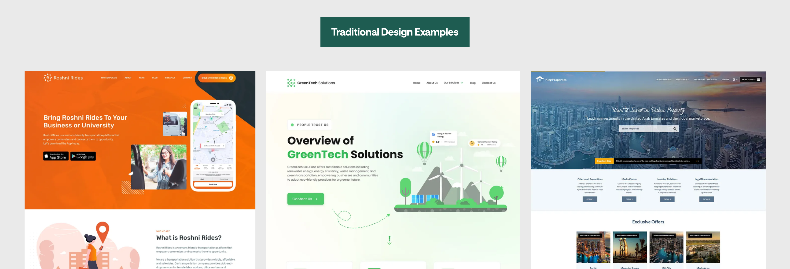
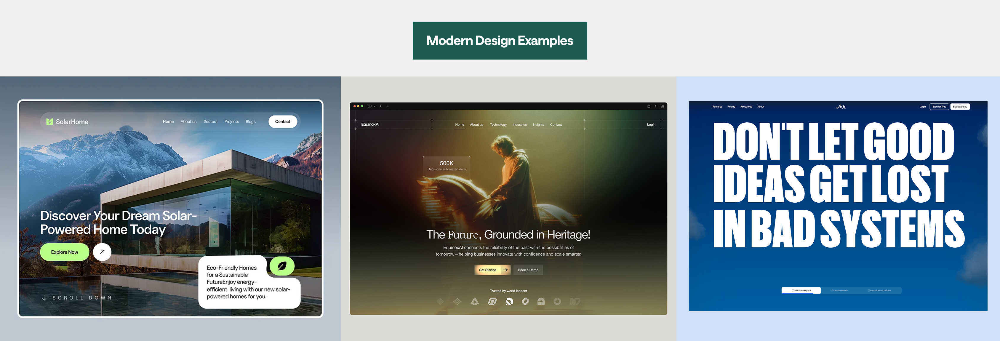

# - UI/UX Motion Roadmap -

<aside>
 **Hey👋

Welcome to the UI/UX Motion Roadmap Roadmap.**

I made this for designers who already know Figma basics and want to actually learn animation, fast. This is a **10-step, action-first** path to get started with animations and interactions in UI: less talk, more doing. 

If you follow it step by step, by the end you’ll have a clean **Figma prototype** (with real micro-interactions) you can **post in your portfolio** or **show to a client**. I’m not here to drown you in theory. I’ve kept each step short with concrete tasks so you can build, test, record, and share.  **Do the tasks. Ship the work.** That’s what gets results. Ready? Let’s start.

---

**For similar content…**

- You can follow me on [Instagram](https://www.instagram.com/ayzz.thedesigner/reels/) & [Tiktok](https://www.tiktok.com/@ayzzthedesigner?lang=en).
</aside>

---

<aside>

# Step 1 : Adopt a Modern Animation Mindset

</aside>

Modern UI design isn’t about animating everything on screen, it’s about using motion **with purpose**. 

Adopting the right mindset means focusing on clarity and storytelling through motion, rather than adding gratuitous effects that might distract or overwhelm users.

<aside>

### Some Common Questions:

- **How does this help my portfolio and getting clients?**
    
    Animated case studies **look more professional**, attractive and have a higher perceived value in the eyes of clients, and **draw more people to contact you**. They also support **higher pricing**, because the work feels crafted, not templated.
    
- **Why modern over traditional in the era of AI?**
    
    AI can churn out basic, template-style UIs. What it *can’t* easily do is the **brand-specific creativity, timing, and interaction feel** that make interfaces memorable. Modern design + motion adds that human layer.
    
    - **AI = templates.** Standard cards/grids are easy for AI to copy. They won’t help you stand out.
    - **Modern motion = creativity.** Choosing *what* moves, *how* it moves, and *why* it moves (timing, easing, storytelling) is human judgment AI struggles to invent at a high level.
    - **Better UX, not just looks.** Purposeful animation guides attention, explains changes, and gives feedback, making products easier to use.
    - **Two safe paths if you want complete security from AI long term (you can blend them):**
        1. Go deep into **UX research** (every UI elements is based decisions backed by real findings).
        2. Specialize in **modern interactive visuals** (motion-led storytelling).
    - **Practical upside:** Modern, well-animated work looks premium, gets noticed more, and is **harder to copy** than static layouts.
    - **Use it with restraint.** Not every screen needs animation, apply motion where it **helps the goal**.
    
    **Bottom line:** Moving from traditional → modern gives you **defensibility against AI** while staying user-centered.
    
- **Why add animation at all? What’s the benefit?**
    
    It **guides the eye**, explains what just changed, gives **instant feedback**, and makes interfaces **feel faster and more premium**. Used with intent, small motions improve clarity and confidence without being flashy. 
    
    **Most importantly, it has higher perceived value so clients pay premium pricing, all the brand we work with in our agency are premium brands cuz they are tired of their websites looking same like all other websites in the industry they want to stand out, they want to make a difference in the industry, so if as a designer your offer is modern, animated websites & UIs , the clients and business you will attract will be all premium brands.**
    
- **Do all websites need lots of animation?**
    
    No. Motion depends on the business and audience. The goal is to move from **traditional UIs → modern UI**. Even a few smart micro-interactions (hover, press, smooth state change) can make a site feel modern without noise.
    
</aside>

## Your tasks:

- [ ]  The most important step that you can take at first is to switch your inspiration sources, the designs you get inspired from is always similar to designs you create.

Difference:

So here are some inspiration sources **(Save them)**:

[
Inspiration Sources](Inspiration%20Sources%20c0c3008b46fd82a4baf1813b737a192b.md)

- [ ]  Install [Muzli Chrome Extension](https://chromewebstore.google.com/detail/muzli-design-inspiration/glcipcfhmopcgidicgdociohdoicpdfc?hl=en) for daily design Inspo.

---

<aside>

# Step 2 : Level Up Your Visual Style

</aside>

Before motion, make static design feel modern: **grid play, layering/overlap, depth (shadow/blur), bold type, contrast**. This is the stage your motion performs on.

Take a look on some sites from awwwards and check how their play with grid is a lot different.

## Your tasks:

- [ ]  Collect 5 refs from Awwwards.
- [ ]  Take screenshot of those hero’s and paste them in Figma.
- [ ]  Design a those 5 hero's yourself and analyse what’s different.

P.S. I can give you so much theory but this roadmap is action-based so make sure to do these things.

---

<aside>

# Step 3 : Master Timing & Easing Basics

</aside>

How it moves = how it feels. Pick default **durations** and **easings** so everything is consistent and natural.

In Figma, whenever you prototype, there are some curves that always look smooth but I suggest you to experiment as well but I’ve pasted my curve I use almost 90% of the time rather than just going linear.

Obviously, if you’re using After Effects or Protopie for prototyping and animation the curves will be different but learn these curves because they can make or break the animation.

[Example curve for Figma Prototypes](Example%20curve%20for%20Figma%20Prototypes%20e6b3008b46fd83bcbac581ee1a4d5f92.md)

## Your tasks:

- [ ]  [Watch this Reel](https://www.instagram.com/reel/DHBWmEuNsGC/)
- [ ]  Re-create the whole design from reel and animation and then experiment with curves, just have some fun with it for 20 mins, try out all the curves and see what it does.

[How animation works if you don’t know already (for beginners)](How%20animation%20works%20if%20you%20don%E2%80%99t%20know%20already%20(for%205993008b46fd83739cc281998c9b54bf.md)

- [ ]  Watch [12 Principles of motion](https://www.youtube.com/watch?v=uDqjIdI4bF4)
- [ ]  Now try animating the hero’s you created.

---

<aside>

# Step 4 : Animating Practice

</aside>

Practice is where your skills turn into **instinct**. Reading about timing, easing, or “before → after” states is useful, but only repetition teaches your hands and eyes what *feels* right. As you recreate small interactions, you’re also training your taste, spotting why one animation looks premium while another looks clumsy.

Consistent practice compounds. Six short sprints done this week beat one long weekend session because you’ll iterate, record, review, and correct sooner. 

Replicate first to learn the mechanics; then tweak, remix, and apply the same idea in new contexts. That loop: replicate → review → refine → remix—is how you turn knowledge into a reliable, modern motion style.

## Your tasks:

- [ ]  So I’ve added some animation short tutorial links here for you to just follow the tutorial and make the same thing and then try to make the same animation with your own design and that’s the best approach to learn.

[5  Short Tutorials (for practice)](5%20Short%20Tutorials%20(for%20practice)%200633008b46fd83e59e118138f5321a04.md)

- [ ]  Now after recreating them all, you’ll have pretty good idea of how you can animate anything, so just go experiment with things.

---

<aside>

# Step 5 : Animate your own designs

</aside>

Take the hero you designed in Step 2 and bring it to life. Think **Before → (curve) → After**: decide *what* moves and *why* (read order, emphasis), then connect the states with Smart Animate. Keep it purposeful and fast, polish, not fireworks.

**Inspiration:**
Most designer don’t think of that but just like you took inspiration for designing something, why not take inspiration while animating it.

## Your tasks:

- [ ]  **Inspiration check:** On **Awwwards**, refresh a few sites and note each hero’s **before state** (off-screen/low emphasis) vs **after state** (at rest). Copy the **pattern**, not the visuals.
- [ ]  **Pick your hero:** list 3–5 elements to animate (e.g., headline, subhead, CTA, main image, accent shape).
- [ ]  **Make states:** duplicate your hero frame. In **Before**, change properties like:
    - Headline: **y +16–24px**, **0% → 100% opacity**
    - Subhead: **+8–12px**, **0% → 100%** (delay)
    - CTA: **outline → filled**, **scale 0.98 → 1**
    - Image: **scale 0.96 → 1**, **blur 8px → 0**
- [ ]  **Prototype:** connect **Before → After** with **Smart Animate.**
- [ ]  **Quality check:** reads in correct order? too many things moving?

---

<aside>

# Step 6 : Learn to design & animate other sections

</aside>

Move past the hero and give the **next sections** a calm, consistent rhythm. Think story: each section has a lead element, supporting info, and a call to action. Use the same reveal “logic” everywhere so the page feels intentional, not noisy.

## Your tasks:

- [ ]  **Define the story per section**: write one line for the *point* of each section and which element should get attention first.
- [ ]  **Pick a reveal pattern** you’ll reuse (e.g., **Lead → Support → Action** *or* **Media → Headline → Details**). Stick to it across sections.
- [ ]  **Choose a motion recipe** (from Step 3): one duration tier for small reveals, one easing you’ll use by default, and a modest movement/opacity range. Keep it consistent.
- [ ]  **Limit concurrency**: only a few elements animate at once. Everything else stays still so attention is clear.
- [ ]  **Simulate scroll smoothly**: make “before/after” states for each section and advance between them so the whole page feels continuous.
- [ ]  **Balance density**: if a section feels busy, reduce how many elements move or shorten the total reveal window.

---

<aside>

# Step 7 : Learn to Export & Showcase

</aside>

You’ve got working prototypes, now **package them for eyes**. 

Two paths:

- **After Effects (AE):** render the video (or export Lottie) → done.
- **Figma:** **screen-record** your prototype cleanly → trim/crop in **CapCut** → export.

If you’re animating in After Effect then good you can just export it but if you’re prototyping in Figma:

[Here’s how to record and present it](Here%E2%80%99s%20how%20to%20record%20and%20present%20it%204d53008b46fd8281bd350139978b5136.md)

## Your tasks:

- [ ]  Record and edit your prototype to get it ready for portfolio or devs.

---

<aside>

# Step 8 : Learn how we hand it to developer

</aside>

Your **Figma prototype is the proof** of how the final site should feel. It lets clients preview the result and helps developers (**Webflow / Framer / code**) build without guessing. Use two simple handoff modes:

1. **Show & Tell:** share your Figma file + your animation prototype so the dev can copy the motion as-is.
2. **Reference & Explain:** if you didn’t animate every detail, share static states (figma file) + 2–3 reference clips and agree on timings and easing in a quick call (usually this step takes longer and developers sometimes make the whole animation wrong so 1st step is best cuz you already have your prototype preview).

The goal: **reduce ambiguity**. Show the motion, then add a few **plain notes (trigger, duration, easing, what changes)** so devs can match it exactly.

## Your tasks (if you’re handing it to a developer):

- [ ]  **Pick a handoff mode:** **Show & Tell** (best) **or** **Reference & Explain** (when only planning the motion).
- [ ]  **Share links:** view-only **Figma file + prototype link** and a **30–60s clip** per key interaction (hero entrance, modal, toggle, loading→success).
- [ ]  **Name clearly** in Figma: frames/components/variants (e.g., `Button/Default`, `Button/Hover`, `Modal/Open`).
- [ ]  **Attach assets** if needed: **Lottie JSON** (AE), SVG icons, illustrations; say **where** each goes.
- [ ]  **10-min alignment call:** confirm platform (**Webflow/Framer/code**), limits (e.g., heavy blur), and a default rule (e.g., “small UI transitions = 300ms ease-out”).
- [ ]  **Package it cleanly:** one message with all links + a one-page “motion notes” table so devs have everything in one place.

---

<aside>

# Step 9 : Learn to build a portfolio

</aside>

You’ve got motion pieces, now **show them where people can see them**. Pick **one main platform** (Dribbble, Behance, Instagram, LinkedIn, or X) and post **consistently**. Treat your feed as a simple system that helps **clients find you**. Then collect your best posts into clean **case studies** on a site or Notion page.

<aside>

**One Imp Takeaway:**

I see a lot of people telling you “only show your best projects.” That’s only half true. **Your portfolio (site/Notion) is where you curate the top pieces.** But on **Dribbble, Behance, IG, LinkedIn, X**, **post everything you create.** Your social feed isn’t a museum; it’s how people discover you. Different clients need different things, the design you think is “not your best” might be exactly what lands a project. So yes, curate on the portfolio, but **share widely on social**.

</aside>

## Your tasks:

- [ ]  **Choose your home base:** pick **one** main platform (Dribbble/Behance/IG/LinkedIn/X) so you don’t spread thin.
- [ ]  **Post 3–6 designs you learn’t from this roadmap and you can tag me in it as well @ayzz.thedesigner.**
- [ ]  **Make it clear:** use a simple cover and short caption. Add 3–5 sensible tags (e.g., #ui #microinteraction #figma #motiondesign).
- [ ]  **Set a schedule:** 2–3 posts per week for 4 weeks. Batch exports once, then drip them out.
- [ ]  **Pin your best work:** pin 3 top pieces on your profile so new visitors see your strongest examples first.
- [ ]  **Keep it rolling:** every new prototype you make, **post it**. Don’t wait for “perfect.” Your feed is your ongoing proof of skill.

---

<aside>

# Step 10 : The Daily Motion Loop

</aside>

Practice is the **engine**. Reading about motion helps, but only **reps** teach your eyes and hands what *feels* right, durations, easing, offsets, how far to move or fade. Don’t wait to “get good” and then post; **you get good by doing**. 

Design one day, animate it, record it, **post the next day &** repeat. That loop compounds your skill, builds your portfolio **and** your client-inbound system at the same time.

<aside>

I have an Instagram highlight called **“Motion Tutorials”** where I saved all the tutorials I’ve created on UI animation and that highlight is specifically for you to learn different types of animations in Figma.

Use it like a playlist: pick one, **recreate**, then **remix** in your own style. Also keep pulling fresh inspiration from Awwwards, dark.design, and Godly—**recreate → review → refine → remix** is how you grow fast.

</aside>

## Your tasks (add them to your daily to-do list):

- [ ]  **Open IG → “Motion Tutorials” (my highlight):** pick **1 tutorial/day**, recreate it in Figma, then **remix** with your layout/colours.
- [ ]  **Inspiration IN:** save **3 references** per session from **Awwwards / dark.design / Godly**; note *what moves*, *how it enters*, *what stays still*.
- [ ]  **Daily loop:**
    1. **Design** one small piece (hero/card/button)
    2. **Animate** (Before → After, Smart Animate)
    3. **Record** (10–20s, 60 fps)
    4. **Post tomorrow** (IG/Dribbble/LinkedIn/X) — repeat
    

---

<aside>

# Bonus Step : Tools to use

</aside>

Now if you want to be very best and that I suggest you should aim for. There are a lot of tools out there to help you in making these beautiful websites, you don’t necessarily have to stick with only Figma prototyping. Some tools you should explore and learn are:

- **Rive** → interactive vector icons/illustrations with **state machines** (hover, toggle, success). Tiny files, production-friendly.
- **After Effects → Lottie** → logo/loader/illustration with **precise easing & timing**, dev embeds JSON.
- **Spline** → lightweight **3D hero** or depth ornaments (orbit/auto-rotate/parallax), export video/embed.
- **Unicorn Studio** → **scroll-driven/webGL** flourishes and section effects (visual, web-first motion).

I would suggest to not try to cover all these tools, pick one tool out of these and explore all the things you can do with that. If you can master even one out of these tools, you’ll already be in the top percentage of the designers.

---

---

## **✨Before you go, thank you for being here.** ✨

If you followed this roadmap, you’ve already done the hard part: **you took action**. Keep doing the good stuff.

- And if you want more in depth video based learning from start to finish, I’m also planning on making a full course on designing animated, modern UIs that help you stand out, design amazing websites through the process we use at our agency, attract better clients, and charge more. If you’re interested, **drop a comment** on my any post or DM me so, one, I know you guys are interested and second, I know to invite you.

Also **post what you make,** on Instagram, LinkedIn, Dribbble **and tag me @ayzz.thedesigner**. I’d love to see your work, cheer you on, and share my favourites in my stories. 

This is a long game; we learn faster **together**. Keep showing up, keep designing awesome stuff, you’re making life more beautiful than it is through your designs.

### **You’ve got this. 
Abdul Mutakabar Ayaz aka AyzZ**

---

---

<aside>
 This is a free resource. You may not distribute or resell this.

Whenever you’re ready, here are more platforms we can connect on:
IG: [@ayzz.thedesigner](https://www.instagram.com/ayzz.thedesigner/)

Tiktok: [@ayzz.thedesigner](https://www.tiktok.com/@ayzzthedesigner?lang=en)
YT: [@ayzz.thedesigner](https://www.youtube.com/@AyzZ.TheDesigner)

Last updated: October 5, 2025 

</aside>